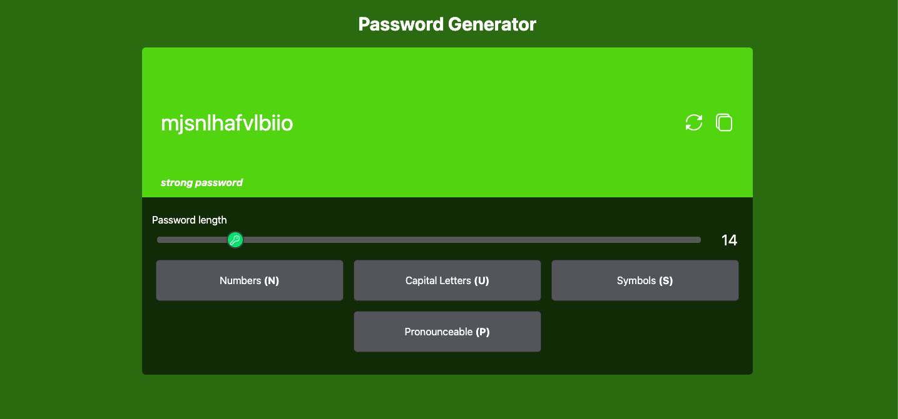
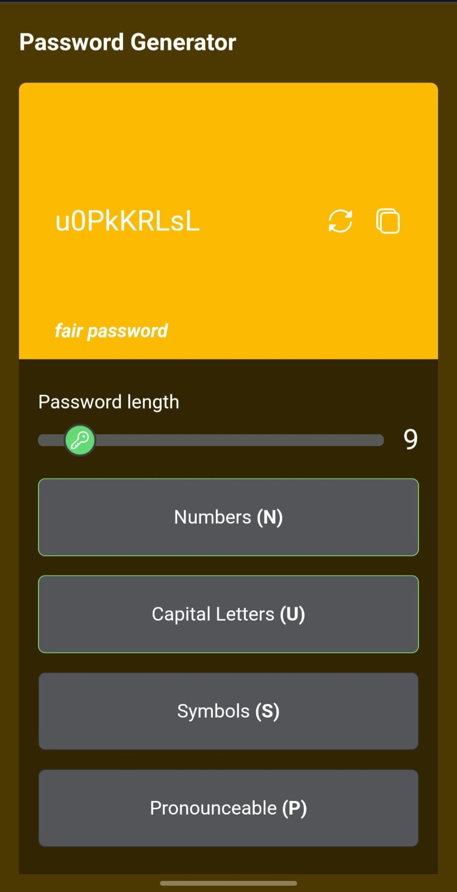

# Password Generator App 🔑


**Live demo**: [password generator](https://complex-password-generator-app.netlify.app/)

## Overview
- The Password Generator App is a simple and efficient tool built with vanilla JavaScript, Tailwind CSS, and bootstrapped using Vite. 
- It allows users to generate passwords with various customization options, including capital letters, numbers, symbols, and the ability to make passwords pronounceable. The app also employs the Zxcvbn library to evaluate and display password strength, categorizing it as weak, fair, or strong.




## Features

- Generate Passwords: Create secure passwords with ease.
- Customization Options: Tailor your passwords by selecting options:
  - Capital Letters
  - Numbers
  - Symbols
  - Pronounceable
- Password Strength: The Zxcvbn library assesses and provides feedback on password strength.
  - Weak: Passwords that are easily guessable.
  - Fair: Passwords that offer moderate security.
  - Strong: Highly secure passwords.

## Usage

1. Open the Password Generator App in your web browser.
2. Configure your desired password options by checking or unchecking the options.
3. Your generated password will be displayed, taking into account your selected options.
4. The app will also provide a password strength rating.

## Installation

To run the Password Generator App locally, follow these steps:

1. Clone this repository to your local machine.
2. Navigate to the project's root directory.
3. Install the required dependencies using npm or yarn:

   ```bash
   npm install
   # or
   yarn install
   ```
4. Run the application `npm run dev`
